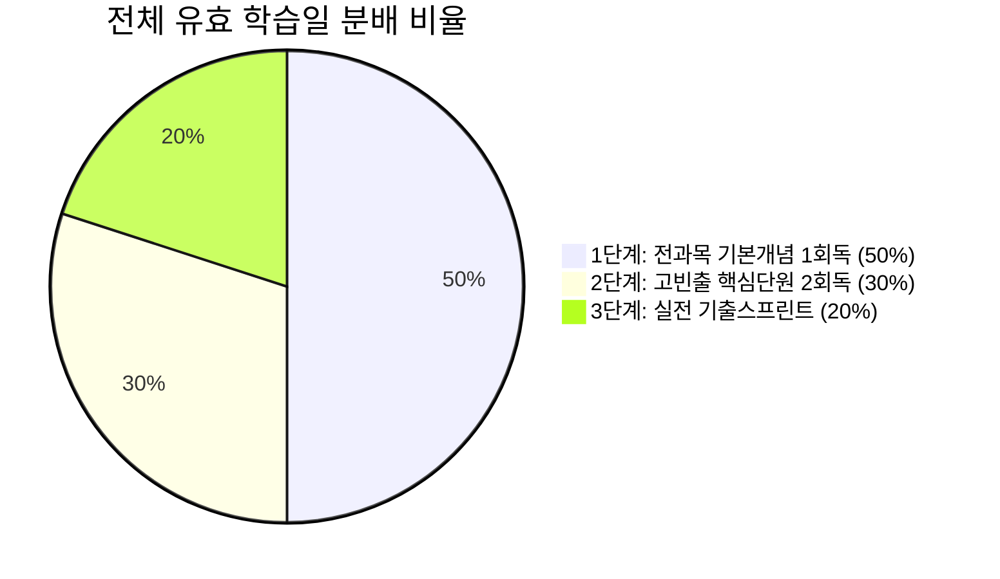

# [개발 계획서] CertiFlow: 자격증 수험 맞춤형 AI 스케줄링 SaaS

> **프로젝트명**: CertiFlow (자격증 시험 역산 스케줄링 플랫폼)  
> **한 줄 소개**: 자격증 시험 스케줄을 관리하기 위한 맞춤형 AI 스케줄러  
> **타깃 사용자**: 국가기술자격증 및 전문자격증을 준비하는 모든 수험생 (취업준비생, 전공자, 비전공자, 직장인 수험생)  
> **작성일**: 2026년 10월  
> **문서 버전**: v1.0.0  

---

## 1. 프로젝트 개요 (Executive Summary)

### 1.1 기획 배경 및 문제 정의
- **방대한 시험 범위와 막막한 일정 배분**: 자격증 시험은 보통 4~5개 과목의 방대한 분량을 다루며, 수험생은 무엇을 먼저, 얼마만큼 공부해야 할지 계획 수립 단계부터 큰 피로를 느낍니다.
- **과락 위험과 비효율적 학습**: 전 과목 평균 60점 이상 합격선뿐만 아니라 과목당 40점 미만 시 불합격되는 '과락' 제도가 존재함에도, 수험생들은 과목별 난이도와 빈출도를 고려하지 못하고 무작정 책 앞부분만 공부하다 시험을 치릅니다.
- **계획 지연 시 일정 붕괴 (도미노 현상)**: 한두 번 계획이 밀리면 전체 스케줄이 무너져 학습 의욕을 상실하는 문제가 흔히 발생합니다.

### 1.2 해결 솔루션 (CertiFlow)
1. **D-Day 역산 3단계 최적 배치**: 전체 수험 일정을 **1단계 개념정독(50%) → 2단계 핵심회독(30%) → 3단계 기출스프린트(20%)**로 자동 분할합니다.
2. **휴식일 반영 순수 학습일 연산**: 수험생이 지정한 주간 정기 휴식 요일(일, 토 등)을 배제하고 '순수 유효 학습일'에만 공부를 배치하여 뇌의 기억 고착화와 번아웃을 예방합니다.
3. **난이도·빈출도 가중치 알고리즘**: 각 과목 단원의 **난이도('상'/'중'/'하')**와 **출제 빈도(1~5성)**를 곱한 가중 점수($W = \text{Difficulty} \times \text{Frequency}$)를 산출하여 핵심 단원에 학습 시간과 회독을 집중 배분합니다.
4. **밀린 일정 원클릭 스마트 재배치**: 미완료된 공부가 감지되면 **다가오는 휴식일을 '보충 학습일'로 전환**하거나 **잔여 일정에 균등 분할**하여 계획 붕괴를 원천 방지합니다.
5. **3대 국가기술자격증(정보처리·정보보안·전기기사) 표준 탑재**: NCS 및 한국산업인력공단 출제 기준 5개 정규 과목을 완벽 수록합니다.

---

## 2. 핵심 기능 요구사항 명세 (Functional Requirements)

| 번호 | 요구 기능 | 세부 설명 | 상태 |
| :---: | :--- | :--- | :---: |
| **F-01** | **수험 기간 및 D-Day 설정** | 시작일과 시험일을 지정하여 전체 잔여일 및 실시간 D-Day 카운트다운 제공 | **완료** |
| **F-02** | **정기/개별 휴식일 지정** | 일(0)~토(6) 주간 휴식 요일 다중 선택, 캘린더에 빗금 패턴 음영 처리 및 순수 유효 학습일 계산 | **완료** |
| **F-03** | **난이도·빈출도 가중치 스케줄링** | 과목별 단원의 난이도('상'/'중'/'하')와 빈출도(1~5성)를 가중 연산하여 3단계 역산 배치 | **완료** |
| **F-04** | **3대 자격증 커리큘럼 탑재** | 정보처리기사(EIP), 정보보안기사(Sec), 전기기사(Elec) 각 5개 과목 풀 데이터셋 구축 | **완료** |
| **F-05** | **지연 일정 스마트 재배치** | 미완료 태스크 감지 시 `휴식일 보충 전환(USE_REST_DAY)` 또는 `잔여일 균등 분할(DISTRIBUTE)` 실행 | **완료** |
| **F-06** | **2-패널 인터랙티브 캘린더/대시보드** | 좌측 월간 그리드 캘린더 + 우측 상세 데일리 학습 패널 (7:5 Split) | **완료** |
| **F-07** | **낙관적 UI 및 학습 진도 추적** | 완료 체크박스 즉시 취소선, 회독수 카운트업(+1회독), 핵심 암기 포인트 아코디언 토글 | **완료** |
| **F-08** | **온·오프라인 듀얼 지원** | Next.js 14 App Router 서버 환경 및 단독 브라우저 더블클릭 오프라인 실행(HTML5) 동시 지원 | **완료** |

---

## 3. 시스템 아키텍처 및 기술 스택 (System Architecture)

```
┌────────────────────────────────────────────────────────────────────────┐
│                        클라이언트 인터페이스 (Frontend)                 │
│   Next.js 14+ (App Router, TS) / Tailwind CSS / Lucide React / Shadcn │
│   - StudyCalendar.tsx (7컬럼 인터랙티브 캘린더, 고난도🔥 뱃지, 빗금 휴식일)   │
│   - DayTaskPanel.tsx (5컬럼 Sticky 데일리 패널, 회독수 카운트업, 핵심 포인트) │
│   - OnboardingModal.tsx (3대 자격증 선택 & 5개 과목 난이도 실시간 프리뷰)     │
│   - RescheduleDialog.tsx (지연 일정 스마트 재배치 모달)                │
└───────────────────────────────────┬────────────────────────────────────┘
                                    │
                                    ▼
┌────────────────────────────────────────────────────────────────────────┐
│                       상태 관리 & 스케줄링 엔진 (Engine)                 │
│   - Zustand Store (useStudyScheduleStore.ts) + LocalStorage Persist    │
│   - scheduleEngine.ts (난이도·빈출도 가중치 연산, 3단계 역산 분배, 지연 재배치)│
│   - curriculumPresets.ts (정보처리·보안·전기 3대 자격증 정규 5과목 데이터셋)    │
└───────────────────────────────────┬────────────────────────────────────┘
                                    │
                  ┌─────────────────┴─────────────────┐
                  ▼                                   ▼
┌──────────────────────────────────┐ ┌───────────────────────────────────┐
│     백엔드 API 라우트 (Backend)    │ │      데이터베이스 & 보안 (DB)      │
│  - /api/generate-schedule (POST) │ │  - Supabase PostgreSQL (Auth/SSR) │
│  - /api/reschedule (POST)        │ │  - profiles, study_plans, tasks   │
│  - OpenAI GPT-4o-mini 연동       │ │  - Row Level Security (RLS) 정책  │
│  - 내장 규칙 엔진 자동 Fallback  │ │    (auth.uid() = user_id 엄격 격리)│
└──────────────────────────────────┘ └───────────────────────────────────┘
```

### 3.1 기술 스택 세부 명세
- **Framework**: Next.js 14+ (App Router, TypeScript, React 18)
- **Styling**: Tailwind CSS, Pretendard, JetBrains Mono
- **State Management**: Zustand with LocalStorage Persist (낙관적 UI 및 오프라인 복원)
- **Database & Auth**: Supabase PostgreSQL, Supabase SSR Auth Client, Row Level Security (RLS)
- **AI Engine**: OpenAI API (`gpt-4o-mini`) Structured Outputs + 가중치 연산 규칙 엔진
- **배포 인프라**: Vercel Global Edge Network

---

## 4. 데이터베이스 설계 (Database Schema & RLS)

Supabase SQL Editor에서 즉시 실행 가능한 프로덕션 DDL:

```sql
-- 1. 프로필 테이블 (auth.users 연동)
CREATE TABLE public.profiles (
  id UUID PRIMARY KEY REFERENCES auth.users(id) ON DELETE CASCADE,
  created_at TIMESTAMPTZ DEFAULT TIMEZONE('utc', NOW()) NOT NULL,
  email TEXT
);

-- 2. 자격증 수험 플랜 테이블
CREATE TABLE public.study_plans (
  id UUID PRIMARY KEY DEFAULT gen_random_uuid(),
  user_id UUID NOT NULL REFERENCES public.profiles(id) ON DELETE CASCADE,
  title TEXT NOT NULL,
  start_date DATE NOT NULL,
  exam_date DATE NOT NULL,
  daily_study_hours NUMERIC DEFAULT 3.0 NOT NULL,
  rest_days_weekly INTEGER[] DEFAULT ARRAY[0, 6], -- 0(일), 6(토)
  custom_rest_dates DATE[] DEFAULT ARRAY[]::DATE[],
  curriculum_source TEXT,
  created_at TIMESTAMPTZ DEFAULT TIMEZONE('utc', NOW()) NOT NULL
);

-- 3. 일자별 학습 태스크 테이블
CREATE TABLE public.study_tasks (
  id UUID PRIMARY KEY DEFAULT gen_random_uuid(),
  plan_id UUID NOT NULL REFERENCES public.study_plans(id) ON DELETE CASCADE,
  task_date DATE NOT NULL,
  phase INTEGER NOT NULL CHECK (phase IN (1, 2, 3)), -- 1:개념, 2:회독, 3:기출
  subject TEXT NOT NULL,
  chapter TEXT NOT NULL,
  difficulty TEXT DEFAULT '중' CHECK (difficulty IN ('상', '중', '하')),
  frequency INTEGER DEFAULT 3 CHECK (frequency BETWEEN 1 AND 5),
  weight_score INTEGER DEFAULT 6,
  learning_points TEXT[] DEFAULT ARRAY[]::TEXT[],
  estimated_minutes INTEGER NOT NULL,
  review_count INTEGER DEFAULT 1 NOT NULL,
  is_completed BOOLEAN DEFAULT FALSE NOT NULL,
  is_rest_day BOOLEAN DEFAULT FALSE NOT NULL,
  completed_at TIMESTAMPTZ
);

-- 4. 보안 설정 (Row Level Security 활성화)
ALTER TABLE public.profiles ENABLE ROW LEVEL SECURITY;
ALTER TABLE public.study_plans ENABLE ROW LEVEL SECURITY;
ALTER TABLE public.study_tasks ENABLE ROW LEVEL SECURITY;

-- 5. RLS 정책 부여 (자신의 데이터만 CRUD 가능)
CREATE POLICY "Users can manage own profile"
  ON public.profiles FOR ALL
  USING (auth.uid() = id);

CREATE POLICY "Users can manage own study plans"
  ON public.study_plans FOR ALL
  USING (auth.uid() = user_id);

CREATE POLICY "Users can manage own study tasks"
  ON public.study_tasks FOR ALL
  USING (
    EXISTS (
      SELECT 1 FROM public.study_plans
      WHERE public.study_plans.id = public.study_tasks.plan_id
      AND public.study_plans.user_id = auth.uid()
    )
  );
```

---

## 5. 가중치 연산 및 3단계 역산 스케줄링 알고리즘

### 5.1 가중 점수 공식 (Weight Score Formula)
각 단원의 학습 중요도와 배분 시간을 결정하는 수학적 모델:

$$\text{Weight Score}(W) = \text{Difficulty Multiplier} \times \text{Frequency Stars}$$

- **난이도 계수**:
  - `상` = $3.0$ (공식 유도, 코드 추적, 복합 판별 등 고난도 개념)
  - `중` = $2.0$ (표준 원리 이해 및 일반 계산)
  - `하` = $1.0$ (단순 명칭 암기 및 절차 식별)
- **빈출도 별점**:
  - $1 \sim 5\text{성}$ (최근 5~10개년 기출 출제 빈도 반영)
- **가중치 범위**: 최소 $1$점 ~ 최대 $15$점

### 5.2 3단계 역산 분배 로직 (3-Phase Back-Casting)



1. **Phase 1: 전 과목 기본 개념 1회독 (총 유효 학습일의 50%)**
   - 5개 과목의 모든 단원을 빠짐없이 균형 있게 배치하여 과락(40점 미만)을 원천 차단.
   - 가중 점수가 높은 단원(난이도 '상')은 일일 학습 시간을 $1.1$배로 가중 보정.
2. **Phase 2: 고빈출·고난도 핵심 압축 2회독 (총 유효 학습일의 30%)**
   - 빈출도 $4 \sim 5\text{성}$ 및 난이도 '상'인 **고빈출 핵심 단원만을 선별**하여 2회독 복습 배치.
   - 키워드 앞머리에 `🔥 [빈출 X성 암기]` 태그 자동 부여.
3. **Phase 3: 실전 기출스프린트 및 파이널 오답노트 (총 유효 학습일의 약 20%, 최소 3일 ~ 최대 14일)**
   - 최근 5개년 회차별 실전 기출 풀이(150분 타이머 측정, 평균 60점 합격선 검증).
   - 틀린 문항 오답노트 정리 및 취약 과목 단권화 학습 집중.

---

## 6. 3대 국가기술자격증 커리큘럼 명세

### 6.1 정보처리기사 (Engineer Information Processing)
- **합격 기준**: 과목당 40점 이상, 5과목 평균 60점 이상 (객관식 100문항, 150분)
- **과목 구성**:
  1. **소프트웨어 설계**: 요구사항 확인(중/4성), 화면 설계(하/3성), GoF 디자인 패턴(상/5성), 인터페이스 설계(중/4성)
  2. **소프트웨어 개발**: 데이터 입출력·자료구조(상/5성), 통합 구현·연계(중/4성), 패키징·형상관리(하/3성), 애플리케이션 테스트(상/5성)
  3. **데이터베이스 구축**: SQL DDL/DML/DCL(상/5성), 트랜잭션·ACID(상/5성), 물리 DB·인덱스(중/4성), 정규화 1NF~BCNF(상/5성)
  4. **프로그래밍 언어 활용**: C 포인터·메모리(상/5성), Java 객체지향·상속(상/5성), Python 기초(중/4성), OS 스케줄링·가상메모리(상/5성)
  5. **정보시스템 구축관리**: 개발 보안·암호화(상/5성), 인프라 보안·DDoS(중/4성), 비용산정·애자일(하/3성)

### 6.2 정보보안기사 (Engineer Information Security)
- **합격 기준**: 과목당 40점 이상, 5과목 평균 60점 이상 (객관식 100문항, 150분)
- **과목 구성**:
  1. **시스템 보안**: OS 구조·권한(중/4성), 버퍼오버플로우·ASLR(상/5성), 시스템 로그·포렌식(상/5성)
  2. **네트워크 보안**: TCP 3-Way·패킷분석(상/5성), SYN Flooding·DDoS(상/5성), 방화벽·IDS·Snort(상/4성)
  3. **애플리케이션 보안**: OWASP Top 10·XSS·SQLi(상/5성), 이메일 보안 SPF·DNSSEC(중/4성), DB 보안·SSL/TLS(중/3성)
  4. **정보보안 일반 및 암호학**: 대칭키·AES·CBC모드(상/5성), 공개키 RSA·ECC·전자서명(상/5성), SHA-256·PKI(상/4성)
  5. **정보보안 관리 및 법규**: ISMS-P 인증기준(상/5성), 위험관리 ALE공식(중/4성), 개인정보보호법·벌칙(상/5성)

### 6.3 전기기사 (Engineer Electricity)
- **합격 기준**: 과목당 40점 이상, 5과목 평균 60점 이상 (객관식 100문항, 150분)
- **과목 구성**:
  1. **전기자기학**: 쿨롱의 법칙·가우스(상/5성), 도체계·정전에너지(상/4성), 비오-사바르·앙페르(상/5성), 패러데이·맥스웰(상/5성)
  2. **전력공학**: 선로정수·코로나(상/5성), 4단자정수·페란티(상/5성), 대칭좌표법·고장계산(상/5성), 배전선로·피뢰기(중/4성)
  3. **전기기기**: 직류기·전기자반작용(상/4성), 동기기·유기기전력(상/5성), 변압기 등가회로·결선(상/5성), 유도전동기·슬립(상/5성)
  4. **회로이론 및 제어공학**: RLC 공진·삼각전력(상/5성), 3상 교류·2전력계법(상/4성), 라플라스 변환(상/5성), 보드선도·루스판별(상/4성)
  5. **전기설비기술기준 (KEC)**: KEC 접지시스템(상/5성), 전선로·이도계산(중/4성), 옥내배선·ELB(중/5성), 특고압·ESS규정(상/4성)

---

## 7. UI / UX 인터랙션 및 화면 설계

### 7.1 화면 구조 (7:5 스플릿 레이아웃)
- **데스크톱**:
  - **좌측 7컬럼**: 대형 인터랙티브 월간 캘린더 (연월 이동, 당일 하이라이트, 시험일 D-Day 뱃지, 과목별 컬러 태그, 고난도🔥 아이콘, 휴식일 대각선 빗금)
  - **우측 5컬럼**: Sticky 상세 데일리 패널 (선택 날짜 D-Day, 당일 진도율 프로그레스 바, 태스크 카드, 난이도·빈출도 뱃지, +1회독 버튼, 핵심 암기 포인트 아코디언 토글)
- **모바일**: 상단 반응형 캘린더 뷰 + 하단 선택일 태스크 리스트 세로 배치.

### 7.2 지연 일정 스마트 재배치 시나리오
1. 과거 일자에 미완료 태스크가 감지되면 상단에 **경고 알림 배너** 자동 노출.
2. `[스마트 재조정 ➔]` 클릭 시 재배치 모달 팝업:
   - **옵션 1 (휴식일 활용 - 권장)**: 가장 가까운 다가오는 휴식일을 **"특별 보충 학습일"**로 전환하고 미완료 과제를 이관.
   - **옵션 2 (균등 분할)**: 남은 모든 미래 학습일에 미완료 키포인트를 골고루 나누어 배치하고 일일 공부시간을 +25분씩 자동 조정.

---

## 8. 산출물 및 배포 주소 (Deliverables)

| 산출물 | 파일 경로 / 배포 URL | 설명 |
| :--- | :--- | :--- |
| **라이브 웹 앱** | [https://skt-aleph-gilt.vercel.app/certiflow.html](https://skt-aleph-gilt.vercel.app/certiflow.html) | Vercel 글로벌 CDN 즉시 배포 URL |
| **메인 포트폴리오** | [https://skt-aleph-gilt.vercel.app/](https://skt-aleph-gilt.vercel.app/) | 상단 네비게이션 및 대표작 카드 연결 |
| **단독 실행 HTML** | [`c:\Users\User\Desktop\sktaleph\certiflow.html`](file:///c:/Users/User/Desktop/sktaleph/certiflow.html) | 더블클릭 시 브라우저에서 즉시 실행되는 올인원 파일 |
| **Next.js 전체 소스** | [`c:\Users\User\Desktop\sktaleph\나의 앱만들기/`](file:///c:/Users/User/Desktop/sktaleph/%EB%82%98%EC%9D%98%20%EC%95%B1%EB%A7%8C%EB%93%A4%EA%B8%B0) | 프로덕션 레벨 풀스택 프로젝트 디렉토리 |
| **가중치 연산 엔진** | [`나의 앱만들기/src/lib/scheduleEngine.ts`](file:///c:/Users/User/Desktop/sktaleph/%EB%82%98%EC%9D%98%20%EC%95%B1%EB%A7%8C%EB%93%A4%EA%B8%B0/src/lib/scheduleEngine.ts) | 3단계 역산 배치 및 재배치 핵심 알고리즘 |
| **3대 자격증 데이터** | [`나의 앱만들기/src/lib/curriculumPresets.ts`](file:///c:/Users/User/Desktop/sktaleph/%EB%82%98%EC%9D%98%20%EC%95%B1%EB%A7%8C%EB%93%A4%EA%B8%B0/src/lib/curriculumPresets.ts) | 3대 자격증 5개 과목 정규 데이터셋 |
